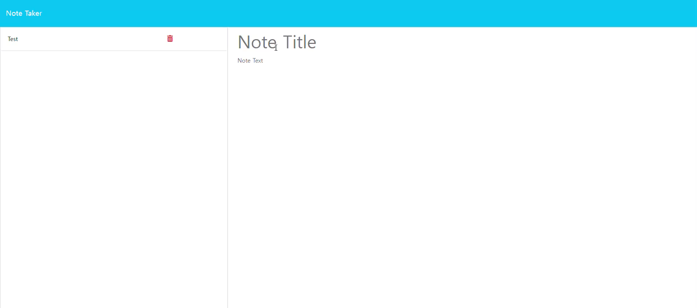

# note-taker

## Table of Contents

<ol>
<li>
<a href="#description"> Description </a>
</li>
<li><a href="#installation"> Installation </a>
</li>
<li>
<a href="#executing-program"> Executing program </a>
</li>
<li><a href="#usage"> Usage </a>
</li>
<li><a href="#contribution"> Contribution </a>
</li>
<li>
<a href="#tests"> Tests </a>
</li>
<li>
<a href="#screenshot-and-video"> Screenshot and Video </a>
</li>
</ol>

## Description

A page where a user can add notes, clear forms, and delete previous notes.

## Installation

npm i
 
Dependencies: express

## Executing program

After installation
 
node server.js
 
Open your [localhost:3001](http://localhost:3001)

## Usage

Create, save, and delete notes

## Contribution

Git clone or fork the repository and create a feature for me  ❤️

## Tests

Run the website using "render" and check if there's any bugs\
Page link: https://note-taker-zjrl.onrender.com

## Screenshot and Video

The following video shows the application's appearance and functionality:\
Click on the image below for a video

